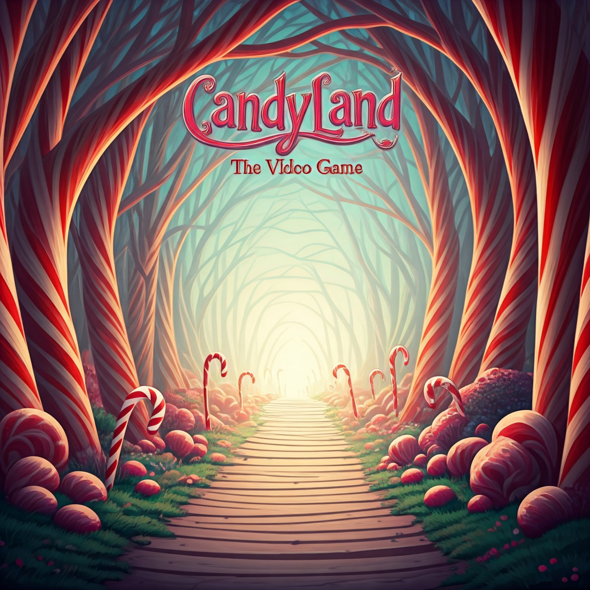

# CandyLand: The Video Game (Unity Prototype)

This repository contains the source code for a video game adaptation of the classic Milton Bradley board game, CandyLand, developed using the Unity engine. This project serves as a prototype to demonstrate core gameplay mechanics.

**Project Overview**

This project aims to create a basic, playable version of CandyLand within the Unity environment. The focus is on implementing the fundamental elements of the board game:

* Game Board Representation (visually appealing)
* Player Turns (rolling dice, moving pawns)
* Engaging User Interface (intuitive controls, clear turn indicators)
* Optional: Single-Player Mode (with a basic AI opponent)

**Development**

* **Engine:** Unity
* **Estimated Development Time:** (to be determined)
* **Team:** (list your team members)

**How to Run (Once Available)**

Instructions on how to run the game will be provided here after development progresses.

**Current Status**

(Provide a brief update on the project's current stage of development.)

**Future Improvements**

* Enhanced AI opponent behavior (for single-player mode)
* Richer game board visuals and animations
* Multiplayer functionality (online or local)
* Sound effects and background music
* Additional features based on user feedback

**Contributing**

We welcome contributions! If you're interested, please fork the repository and submit a pull request with your changes.

**License**

(Choose an appropriate license, e.g., MIT License)

**Contact**

(Provide your contact information)

**Note:**

* Replace `(to be determined)` with the estimated development time for your project.
* Replace `(Provide a brief update on the project's current stage of development.)` with a description of your current progress.
* Update the contact information with your email addresses or preferred contact method.
