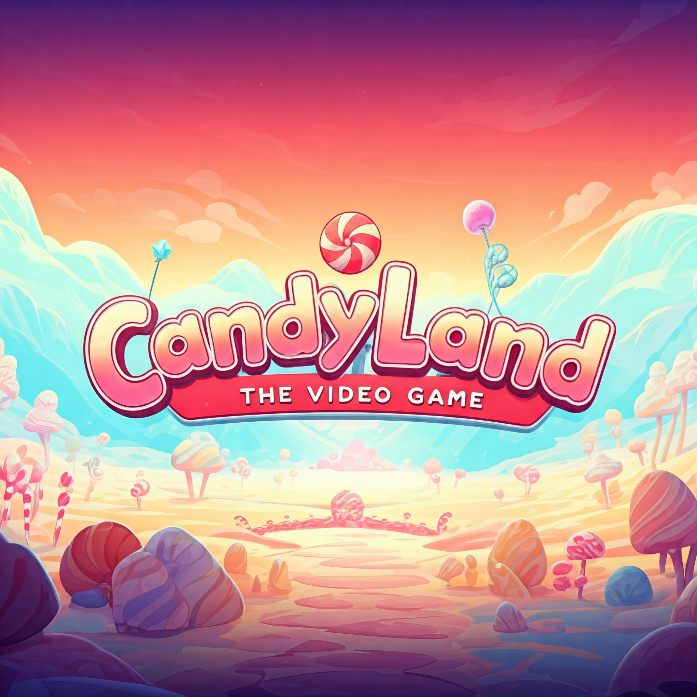

# CandyLand: The Video Game (Unity Prototype)



We are adapting the beloved **CandyLand** board game by Milton Bradley into a digital experience using the Unity engine. This prototype showcases the game's core mechanics while preserving the colorful, family-friendly spirit of the original.

---

## Table of Contents
1. [Project Overview](#project-overview)  
2. [Development Details](#development-details)  
3. [How to Run](#how-to-run)  
4. [Current Status](#current-status)  
5. [Future Improvements](#future-improvements)  
6. [Contributing](#contributing)  
7. [License](#license)   

---

## Project Overview

This project focuses on bringing **CandyLand board game** to life in a 3D environment, with simple turn-based gameplay and an intuitive user interface. Key objectives include:

- **Authentic Board Representation:** A playful, colorful scene representing the CandyLand board.  
- **Turn-Based Play:** Straightforward movement mechanics based on draw-cards or dice (final design pending).  
- **User Interface:** Easy-to-navigate menus and clear player turn indicators.  
- **Single-Player Mode (Optional):** Basic AI for solo play.

---

## Development Details

- **Engine:** Unity 6000.0.0f1 (LTS)  
- **Project Timeline:** 2 weeks  
- **Team Members:**  
  - Trevor H. (Lead Developer)  
  - Bennie T. (Lead modeling)
  - John H. (Code design)
  - Elijah S. (UI/UX design)

---

## How to Run

1. **Unity Version Requirements**  
   - This project requires **Unity 6000.0.0f1 (LTS)**. Make sure you have it installed via [Unity Hub](https://unity.com/products/unity-hub).  

2. **Cloning the Repository**  
   1. Open a terminal or command prompt.  
   2. Navigate to the directory where you’d like to store the project.  
   3. Run the following command (replace `<repository_url>` with the actual Git URL):  
      ```bash
      git clone <repository_url>
      ```
   4. Once cloned, open **Unity Hub**, click **Open**, and select the project folder you just cloned.

3. **Build/Run Instructions**  
   - Within Unity, go to **File > Build Settings**.  
   - Choose your target platform (e.g., Windows, Mac, WebGL) and click **Build**.  
   - After the build is complete, run the generated executable (for Windows/Mac) or host the WebGL build (for web).  

---

## Current Status

**Stage:** Early Prototyping

- **Completed:**
-  Main menu setup / Options menu
  - Load/Save game functionality 
  - Basic board layout and preliminary UI design
  - Landscape and board design
  - *(List any completed items here)*  

- **In Progress:**
  - Turn management (card bases system like the original board game card system)  
  - Player movement logic
   
---

## Possible Future Improvements

1. **Enhanced AI:** Improve challenge for single-player mode.  
2. **Visual & Animation Enhancements:** Create a more immersive experience with animations and effects.  
3. **Multiplayer Mode:** Add potential for local or online multiplayer.   
5. **Feedback-Driven Additions:** Integrate suggestions from testers and community input.
6. **Charectors List:** More characters to choose from besides the base gingerbread 
---

## Contributing

Contributions are welcome! To get involved:

1. **Fork this repository** on GitHub.  
2. **Create a new branch** for your feature or bug fix.  
3. **Submit a pull request** with a detailed explanation of your changes.

---

## License

This project will be available under an open-source license (e.g., [MIT License](LICENSE)).

---

Feel free to reach out and share your ideas or feedback!
